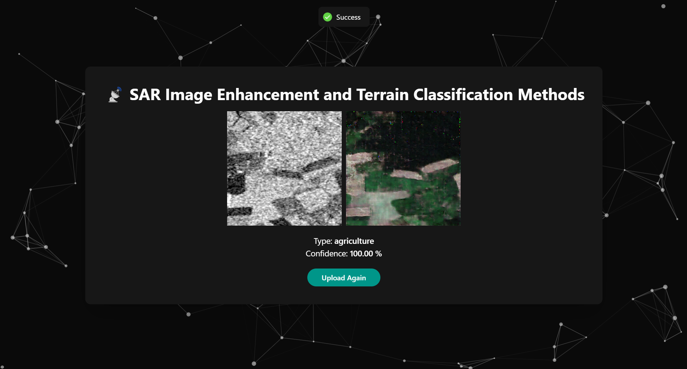

# 📡 SAR Image Enhancement and Terrain Classification Methods

Synthetic Aperture Radar (SAR) image enhancement and terrain classification are essential for accurate remote sensing analysis. Enhancement techniques, such as speckle noise reduction, histogram equalization, and deep learning-based super-resolution, improve image clarity and feature visibility.

For terrain classification, Convolutional Neural Networks (CNNs) are commonly used to segment and categorize land cover types. When combined with enhancement pipelines, these techniques enable precise mapping for real-world applications in agriculture, disaster response, and environmental monitoring.

🎨 SAR Image Colorization with GANs
Generative Adversarial Networks (GANs) play a crucial role in SAR image colorization, transforming grayscale SAR images into visually interpretable RGB representations. Since SAR images inherently lack natural color information, GANs are trained to learn mappings between SAR and optical image domains.

The Generator creates plausible colorized images.

The Discriminator differentiates between real and generated optical images.

This adversarial setup produces realistic and structurally consistent outputs, greatly improving interpretability of SAR data in fields like terrain analysis, disaster mapping, and change detection.

⚙️ Technologies Used
🐍 Python

🔢 NumPy

📊 Matplotlib

👁️ OpenCV

⭕ Keras

📙 TensorFlow

🧠 Models Explored
Several GAN architectures were experimented with to improve color fidelity, structure retention, and training stability:

Model Variant	Description	Result Summary
1. Simple GAN with L1 Loss	Basic encoder-decoder GAN with only L1 reconstruction loss.	Good structure retention, but dull colors.
2. GAN with L1 + SSIM	Combined pixel-level and structural similarity metrics.	Improved color consistency, better edge sharpness.
3. GAN with MSE + L1 + SSIM	Added MSE to stabilize training.	Slightly improved color accuracy, but slower convergence.
4. GAN without Upsampling Decoder	Decoder replaced with basic dense layers.	Very poor image generation; failed to reconstruct fine details.
5. U-Net GAN with Custom Loss	U-Net generator with SSIM + L1 + perceptual loss.	Very strong performance in edge clarity and tonal contrast.
6. U-Net GAN using only CNNs	U-Net with only convolutional blocks, no residuals or attention.	Good detail, but lacked contrast in fine textures.
7. U-Net GAN with Patch Discriminator ✅	Final model. U-Net generator + PatchGAN discriminator + composite loss.	Best in both detail and color realism. Stable training.

✅ Final Architecture: U-Net GAN + Patch Discriminator
🏗️ Generator: U-Net
Encoder-decoder structure with skip connections.

Designed to retain both global shape and local texture.

🔍 Discriminator: PatchGAN
Operates on N×N image patches rather than entire images.

Helps enforce local realism in generated images.

🔥 Custom Loss Function
Combines the strengths of multiple losses:

L1 Loss: Penalizes large pixel-wise differences.

SSIM (Structural Similarity): Ensures perceptual quality.

Perceptual Loss (VGG) (optional): Captures semantic similarity.

📂 Getting Started
bash
Copy
Edit
git clone https://github.com/GitsGoel/SARGAN

cd SARGAN
🗂️ Dataset Preparation
Download the datasets from Kaggle:

SAR Image Colorization Dataset

Sentinel-1/2 Image Pairs for Terrain Classification

Directory Structure
Inside the model folder, create the following structure:

bash
Copy
Edit
data
├───archive
│   └───v_2
│       ├───agri
│       ├───barrenland
│       ├───grassland
│       └───urban
├───test
│   ├───opt
│   └───sar
└───train
    ├───opt
    └───sar
🧪 Model Training
Navigate to the src folder to train both models:

1. Colorization Model (GAN-based)
bash
Copy
Edit
Open and run: src/GAN-colorization.ipynb
This will train the U-Net GAN with Patch Discriminator on SAR-optical pairs for realistic colorization.

2. Terrain Classification Model
bash
Copy
Edit
Open and run: src/classification.ipynb
This model classifies colorized SAR images into terrain categories like agriculture, grassland, barren land, and urban.

💡 Both notebooks are modular and can be adapted to new data formats or architectures easily.

✅ Deploy Models for Inference
After training, copy the trained weights to the server folder:

bash
Copy
Edit
models/GAN-colorization.keras      ➝   server/models/GAN-colorization.keras  
models/classification.keras        ➝   server/models/classification.keras
🧩 Use Cases
Land Cover Mapping

Disaster Assessment

Agricultural Monitoring

Urban Growth Analysis

Environmental Surveillance

👨‍💻 Contributors
Gitansh Goel
Manik Chauhan 

📜 License
This project is released under the MIT License.

Let me know if you'd like:

requirements.txt

Docker setup

REST API deployment documentation

I can generate those next.
